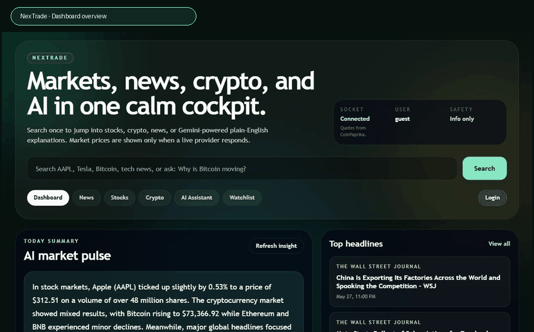
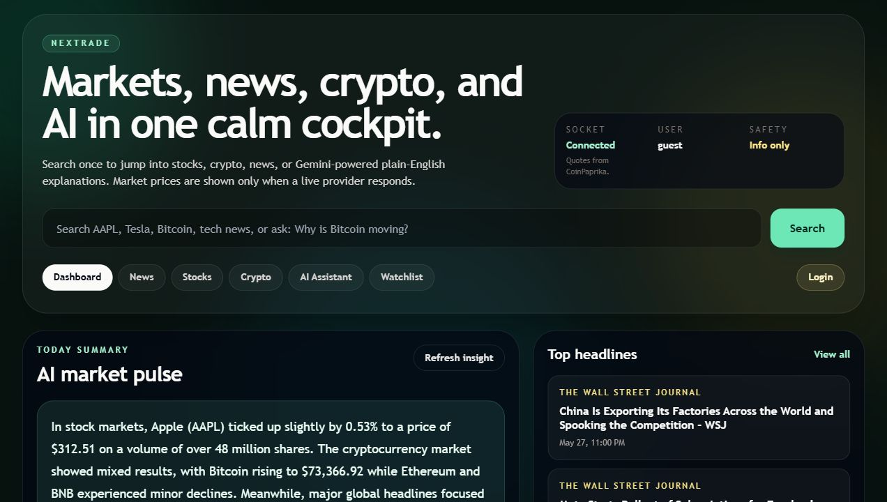
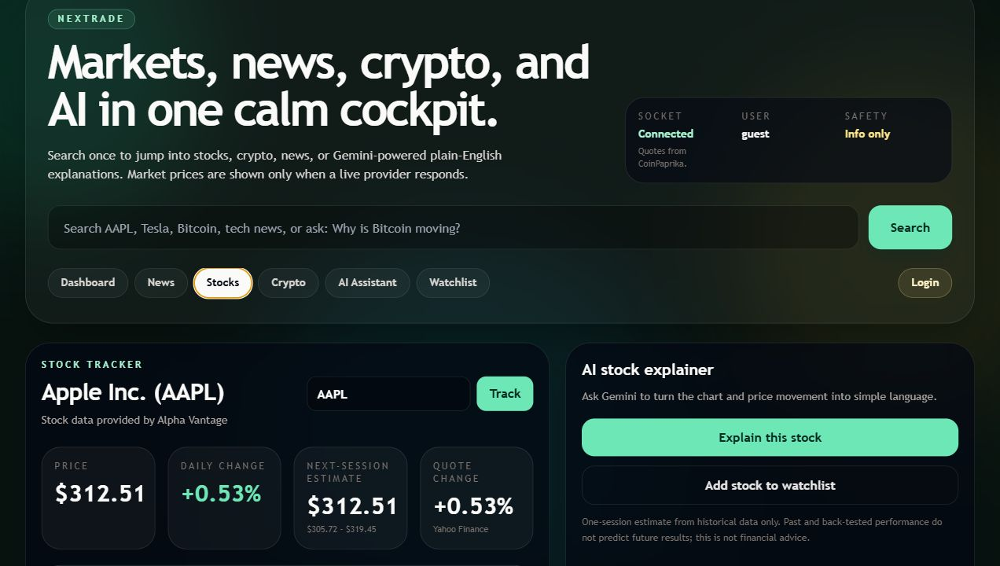
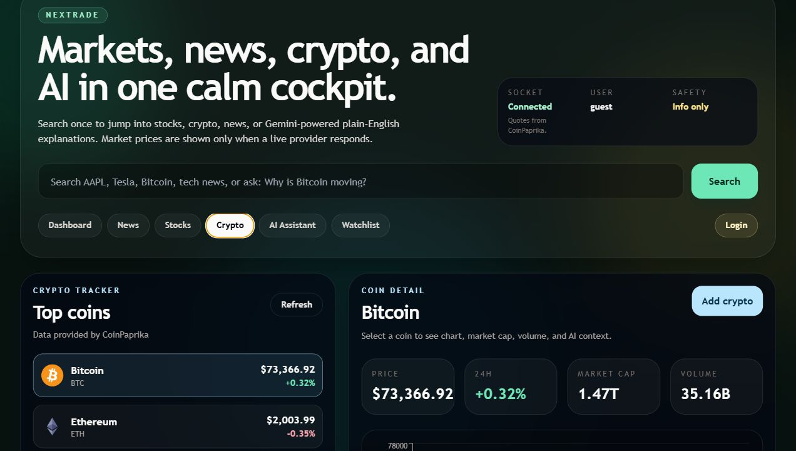
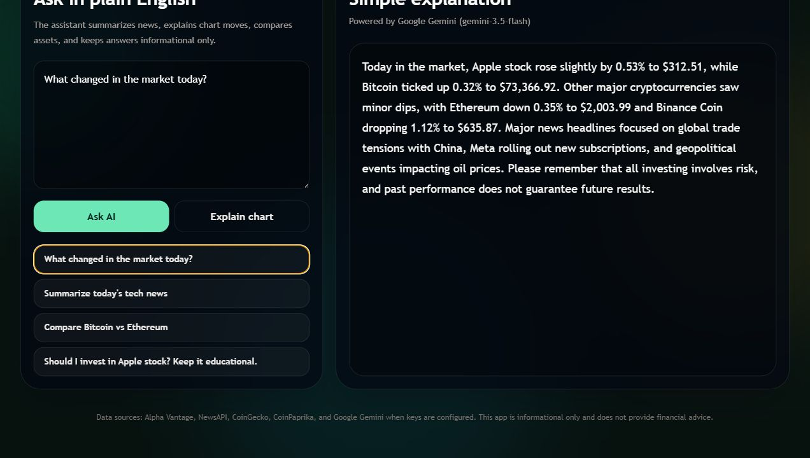

# NexTrade

NexTrade is a full-stack market intelligence dashboard for provider-sourced
stocks, crypto, financial news, watchlists, real-time quote updates, alerts,
and Gemini-assisted plain-English market explanations.

This project is informational and educational only. It is not financial advice,
and its historical next-session estimate is not an investment recommendation.

Live app: [https://nextrade-jgp0.onrender.com/](https://nextrade-jgp0.onrender.com/)

## Silent Walkthrough



## Screenshots

| Dashboard | Stocks |
| --- | --- |
|  |  |
| Crypto | AI Assistant |
|  |  |

## Highlights

- Provider-sourced dashboard for stocks, crypto, news, market movers, and AI summaries.
- Stock search by ticker or company name with OHLC charts and a next-session estimate.
- Crypto market list, detail cards, and historical charts with visible provider attribution.
- News category and topic search with article links, saved articles, and AI summaries.
- Gemini assistant that explains market questions using the live data already shown in the app.
- Socket.IO quote polling for stocks and crypto, plus client-session price alerts.
- Guest and account-based watchlists scoped through signed HttpOnly cookies.
- Single Render Docker deployment that serves the backend, exported frontend, WebSockets, and Python forecast helper.

## Tech Stack

| Area | Technology |
| --- | --- |
| Frontend | Next.js, React, Tailwind CSS, Recharts |
| Backend | Node.js, Express, Socket.IO |
| AI | Google Gemini API, default model `gemini-3.5-flash` |
| Forecasting | Python, NumPy, walk-forward evaluation |
| Deployment | Docker on Render |

## Data Providers

| Data | Primary Provider | Fallback / Behavior |
| --- | --- | --- |
| Stocks | Alpha Vantage | Yahoo Finance fallback for market data and live quote updates |
| Crypto | CoinGecko | CoinPaprika fallback with explicit attribution; recent successful data may be retained through brief outages |
| News | NewsAPI | No fabricated headlines; unavailable provider responses are surfaced to the UI |
| AI | Google Gemini | Labeled educational fallback using currently displayed provider data |

Market prices and headlines are never synthesized as live data. If a provider
does not respond, NexTrade either uses a clearly attributed fallback provider or
shows an unavailable state.

## Repository Structure

```text
NexTrade/
  ai/
    predict.py
    test_predict.py
  backend/
    server.js
    sockets.js
    routes/
      ai.js
      auth.js
      crypto.js
      news.js
      stock.js
      watchlist.js
  frontend/
    app/globals.css
    components/MarketAssistantApp.jsx
    pages/
      _app.js
      crypto.js
      index.js
      login.js
      news.js
      stocks.js
  Dockerfile
  render.yaml
  package.json
  requirements.txt
```

## Local Setup

Requirements:

- Node.js 18 or newer
- npm
- Python 3.10 or newer

Install dependencies:

```bash
npm install
cd frontend
npm install
cd ..
pip install -r requirements.txt
```

Create environment files:

```bash
copy .env.example .env
copy frontend\.env.local.example frontend\.env.local
```

Backend environment:

```env
PORT=5000
NODE_ENV=development
FRONTEND_ORIGIN=http://localhost:3000
JWT_SECRET=replace_with_at_least_24_characters
ALPHA_VANTAGE_API_KEY=
NEWS_API_KEY=
COINGECKO_API_KEY=
GEMINI_API_KEY=
GEMINI_MODEL=gemini-3.5-flash
PYTHON_BIN=python
RATE_LIMIT_WINDOW_MS=900000
RATE_LIMIT_MAX=600
LIVE_POLL_INTERVAL_MS=30000
```

Frontend environment:

```env
NEXT_PUBLIC_API_URL=http://localhost:5000
NEXT_PUBLIC_SOCKET_URL=http://localhost:5000
```

`FRONTEND_ORIGIN` accepts comma-separated allowed origins. Set `TRUST_PROXY=1`
only when the server is behind exactly one trusted reverse proxy.

## Running Locally

Run backend and frontend together:

```bash
npm run all
```

Run a production-style single service:

```bash
npm run build
npm start
```

Development URLs:

- Frontend: `http://localhost:3000`
- Backend health check: `http://localhost:5000/api/health`
- Single-service production-style build: `http://localhost:5000`

## Quality Checks

```bash
npm run check
npm run lint
npm run build
npm run audit
```

## API Surface

```text
GET    /api/health
GET    /api/news/headlines/:country
GET    /api/news?q=market
GET    /api/stock/search/:query
GET    /api/stock/:symbol
GET    /api/stock/:symbol/predict
GET    /api/crypto/top
GET    /api/crypto/search/:query
GET    /api/crypto/:id
GET    /api/crypto/:id/history
POST   /api/ai/explain
POST   /api/ai/summarize-news
POST   /api/ai/market-insight
GET    /api/watchlist
POST   /api/watchlist/add
DELETE /api/watchlist/remove
POST   /api/auth/register
POST   /api/auth/login
POST   /api/auth/logout
GET    /api/auth/verify
```

## Real-Time Events

Browser clients subscribe through Socket.IO:

```js
{ assetType: "stock", symbol: "AAPL" }
{ assetType: "crypto", id: "bitcoin", symbol: "BTC" }
```

Events:

- `price-update`: provider quote with `source`, `price`, `change`, and timestamp.
- `stream-status`: subscription or provider availability status.
- `set-alert`: creates a client-session alert for a subscribed provider quote.
- `alert-triggered`: emitted when a provider quote crosses the configured target.

## Forecasting Method

The `/api/stock/:symbol/predict` endpoint uses up to 100 provider-sourced daily
OHLCV observations and estimates the next trading-session close.

The Python helper compares a last-price baseline with recent weighted drift and
10/20-session log-trend candidates using sequential walk-forward evaluation.
Trend candidates receive weight only when they improve on the baseline
historically, and responses include volatility range, validation count,
backtest error, and a limited reliability label.

Historical and back-tested results do not predict future returns. The estimate
should not be used alone to make investment decisions.

## Deployment

NexTrade is deployed as a Render Blueprint using the included `Dockerfile` and
`render.yaml`. The Docker image builds the exported Next.js frontend, installs
Node and Python dependencies, and runs one Express service for REST APIs,
Socket.IO, static frontend assets, and the Python forecast helper.

Required Render environment variables:

- `JWT_SECRET`
- `ALPHA_VANTAGE_API_KEY`
- `NEWS_API_KEY`
- `GEMINI_API_KEY`

Recommended Render environment variables:

- `COINGECKO_API_KEY` for stronger primary crypto-provider reliability
- `GEMINI_MODEL=gemini-3.5-flash`
- `LIVE_POLL_INTERVAL_MS=30000`

For this single-service deployment, do not set `NEXT_PUBLIC_API_URL` or
`NEXT_PUBLIC_SOCKET_URL` on Render. The exported browser app connects back to
its own Render origin.

## Security And Limitations

- `.env` and `frontend/.env.local` are intentionally ignored by git.
- Sessions use HttpOnly cookies; production cookies are marked `Secure`.
- CORS, request size limits, basic security headers, and auth rate limiting are enabled.
- Watchlists are scoped to either a signed-in user or a signed guest cookie.
- User accounts, sessions, and watchlists are currently memory-backed and reset on service restart.
- Render free instances can sleep when idle and may require a short cold start.
- Production hardening would require persistent storage, durable rate limiting, monitoring, structured logs, and an approved market-data licensing plan.
